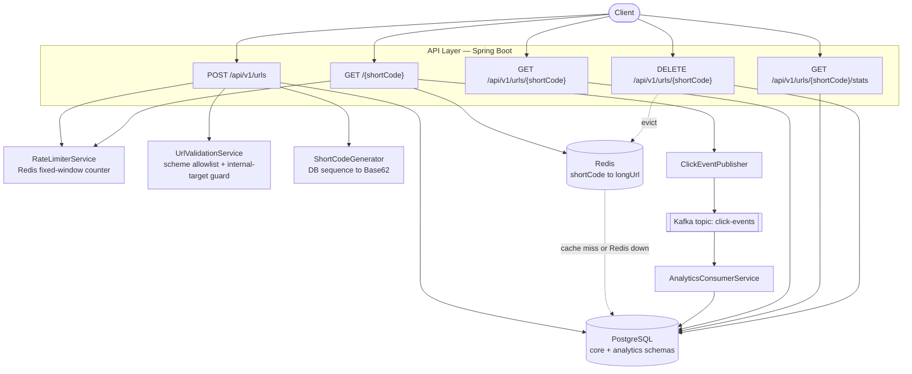

# Architecture & Design

Related: [[../00-Executive-Summary]] · [[02-Agentic-Workflow-and-Jira-Tickets]] · [[03-Business-Rules-and-Guardrails]] · [[04-Setup-and-Run]] · [[05-Risk-and-Failure-Scenario-Analysis]]

## System architecture



## Sequence: redirect, cache-aside (Redis fallback), async analytics

```mermaid
sequenceDiagram
    participant Client
    participant Redirect as RedirectController
    participant Cache as UrlCacheService
    participant DB as PostgreSQL
    participant Publisher as ClickEventPublisher
    participant Kafka
    participant Consumer as AnalyticsConsumerService

    Client->>Redirect: GET /{shortCode}
    Redirect->>Cache: getOrLoad(shortCode)
    alt Redis healthy
        alt cache hit
            Cache-->>Redirect: longUrl
        else cache miss
            Cache->>DB: SELECT ... WHERE short_code = ? AND status = ACTIVE
            DB-->>Cache: longUrl (or empty if gone/expired)
            Cache->>Cache: SET with TTL = min(configured, time-until-expiry) + jitter
            Cache-->>Redirect: longUrl
        end
    else Redis throws DataAccessException (URL-502 fallback)
        Cache->>Cache: log.error(...); skip cache entirely
        Cache->>DB: SELECT ... (direct fallback)
        DB-->>Cache: longUrl
        Cache-->>Redirect: longUrl
    end
    Redirect->>Publisher: publish(ClickEvent) — fire-and-forget
    Redirect-->>Client: 302 Found, Location: longUrl

    Publisher->>Kafka: send(click-events, event)
    Kafka-->>Consumer: deliver event
    Consumer->>Consumer: SETNX processed:{eventId} (24h idempotency guard)
    alt first delivery
        Consumer->>DB: upsert click_summary + click_daily_rollup
    else redelivered (at-least-once)
        Note over Consumer: duplicate detected, aggregation skipped
    end
    Note over Consumer,DB: On processing failure: 2 retries (1s backoff),<br/>then recoverer writes to analytics.click_events_dlq
```

Full Redis-fallback detail → [[../Guardrails/Cache-Aside-Graceful-Degradation]]

## Architecture Decision Records

* [[../Architecture-Decisions/ADR-01-Short-Code-Generation-Strategy]] - Base62 from a DB sequence, collision-free by construction.
* [[../Architecture-Decisions/ADR-02-Custom-Alias-Rules]] - 3–20 chars, reserved-word denylist.
* [[../Architecture-Decisions/ADR-03-Duplicate-Long-URL-Handling]] - no dedup, every create mints a new code.
* [[../Architecture-Decisions/ADR-04-Default-and-Max-TTL]] - no default expiry, 5-year cap.
* [[../Architecture-Decisions/ADR-05-Authentication-Model]] - API key on writes, public redirect. ⚠️ high-impact
* [[../Architecture-Decisions/ADR-06-Redirect-HTTP-Status-Code]] - 302, not 301. ⚠️ high-impact
* [[../Architecture-Decisions/ADR-07-Rate-Limit-Thresholds]] - 100/min create, 1000/min redirect. ⚠️ high-impact
* [[../Architecture-Decisions/ADR-08-Analytics-Granularity]] - near-real-time, exact counts.
* [[../Architecture-Decisions/ADR-09-Data-Retention-Policy]] - 90d raw (Kafka), 2y rollups.
* [[../Architecture-Decisions/ADR-10-Scale-Target]] - 1,000 RPS redirect / 50 RPS create / 100M links.
* [[../Architecture-Decisions/ADR-11-High-Availability-Approach]] - single-region prototype.
* [[../Architecture-Decisions/ADR-12-Geo-Analytics-Scope]] - out of scope, field reserved.

⚠️ = required human approval; changes need the same checkpoint again, not a silent edit.

## Tech stack

| Layer | Choice |
|---|---|
| Runtime | Java 21, Spring Boot 3.3 |
| API | Spring Web (REST), springdoc-openapi |
| Persistence | PostgreSQL 16, Spring Data JPA, Flyway migrations |
| Cache | Redis 7 (Lettuce client, `StringRedisTemplate`) |
| Messaging | Apache Kafka (Spring Kafka), JSON serialization |
| Testing | JUnit 5, AssertJ, Mockito, Testcontainers (Postgres/Redis/Kafka), Awaitility |
