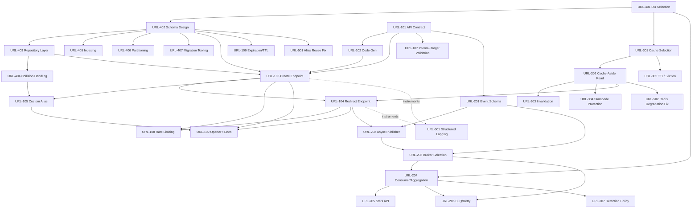

# Agentic Workflow & Jira Tickets — Dashboard

Related: [[../00-Executive-Summary]] · [[01-Architecture-and-Design]] · [[03-Business-Rules-and-Guardrails]] · [[05-Risk-and-Failure-Scenario-Analysis]] · [[../Scenarios/B-Brownfield-Refactoring|Scenario B: Brownfield Refactoring]]

This page is an **index**, not the ticket record. It holds the orchestration model, the
epic-level map, and the dependency graph — the things you need to see all at once. Full
problem/goal, technical implementation plan, and acceptance criteria for every ticket live as
atomic notes in [[../Jira-Tickets/Epic-URL-100-Core-APIs|docs/Jira-Tickets/]], one file per epic,
so this page stays a map instead of becoming an unreadable wall of 28 tickets.

The Greenfield scope (core APIs, async analytics, caching, database) was decomposed into 4
epics and 26 tickets during Phase 1, before any code was written — all **Done** as of Phase 4.
A fifth epic, URL-500, was added in Phase 6 for targeted brownfield remediation.

## Orchestration model recap

Full design in [[01-Architecture-and-Design]]. In short: each ticket is a node with state
`Blocked → Ready → InProgress → InReview → Approved/Rejected → Done`. Entry gate requires all
dependencies `Done`; exit gate requires acceptance criteria met, and for **high-impact**
tickets, explicit human approval.

> [!info] High-impact tickets (required explicit approval)
> Architecture-decision tickets: **URL-102, URL-203, URL-301, URL-401**.
> Schema-change tickets: **URL-402, URL-407**.
> Security-sensitive tickets: **URL-107, URL-108**.
> All were resolved as ADRs — one atomic note per decision in
> [[../Architecture-Decisions/ADR-01-Short-Code-Generation-Strategy|Architecture-Decisions/]] —
> and approved before Phase 3.

## Epic map

### [[../Jira-Tickets/Epic-URL-100-Core-APIs|Epic: URL-100 — Core URL Shortening APIs]]

The client-facing surface: create, redirect, metadata, delete, custom aliases, expiration,
input validation, and rate limiting. 9 tickets (URL-101–URL-109). **Status: Done.**

### [[../Jira-Tickets/Epic-URL-200-Async-Analytics|Epic: URL-200 — Async Analytics Pipeline]]

Click events published on redirect, consumed and aggregated asynchronously over Kafka, with
idempotency and dead-letter handling. 7 tickets (URL-201–URL-207). **Status: Done.**

### [[../Jira-Tickets/Epic-URL-300-Caching-Layer|Epic: URL-300 — Caching Layer]]

Redis cache-aside in front of the redirect hot path — invalidation, stampede protection, TTL
policy. 5 tickets (URL-301–URL-305). **Status: Done**; hardened further in
[[../Jira-Tickets/Epic-URL-500-Brownfield-Remediation|URL-502]].

### [[../Jira-Tickets/Epic-URL-400-Database-Persistence|Epic: URL-400 — Database & Persistence]]

PostgreSQL schema, repository layer, collision handling, indexing, and migration tooling.
7 tickets (URL-401–URL-407). **Status: Done**; schema revised in
[[../Jira-Tickets/Epic-URL-500-Brownfield-Remediation|URL-501]].

### [[../Jira-Tickets/Epic-URL-500-Brownfield-Remediation|Epic: URL-500 — Brownfield Risk Remediation (Scenario B)]]

> [!info] A different kind of epic
> URL-100–URL-400 were decomposed before any code existed (Greenfield). URL-500 exists
> because [[05-Risk-and-Failure-Scenario-Analysis]] found real defects in already-shipped
> code — 2 tickets (URL-501, URL-502), a deliberately narrowed subset of 5 candidate fixes.
> The governance decision behind that narrowing is documented in
> [[../Scenarios/B-Brownfield-Refactoring]]. **Status: Done (scoped).**

### [[../Jira-Tickets/Epic-URL-600-Observability-Logging|Epic: URL-600 — Observability & Structured Logging]]

Retroactive instrumentation of the already-shipped system: SLF4J log levels and a written
data-masking policy so API keys and IPs never leak into logs. 1 ticket (URL-601). Related to,
but distinct from, [[05-Risk-and-Failure-Scenario-Analysis#Risk register|R-8]] (metrics, still
open — this ticket is logs only). **Status: Done.**

## Dependency graph

> [!tip] Parallel tracks
> Once URL-402/403 and URL-103/104 landed, the **Caching (300)** and **Analytics (200)**
> tracks proceeded independently — exactly the non-linear, parallel-with-synchronization
> execution the requirements call for, as opposed to one long linear chain. URL-500 sits
> outside this Greenfield graph entirely — it wasn't planned upfront, it was triggered by
> [[05-Risk-and-Failure-Scenario-Analysis]] after the fact, which is the whole point of it
> being the Brownfield example.
