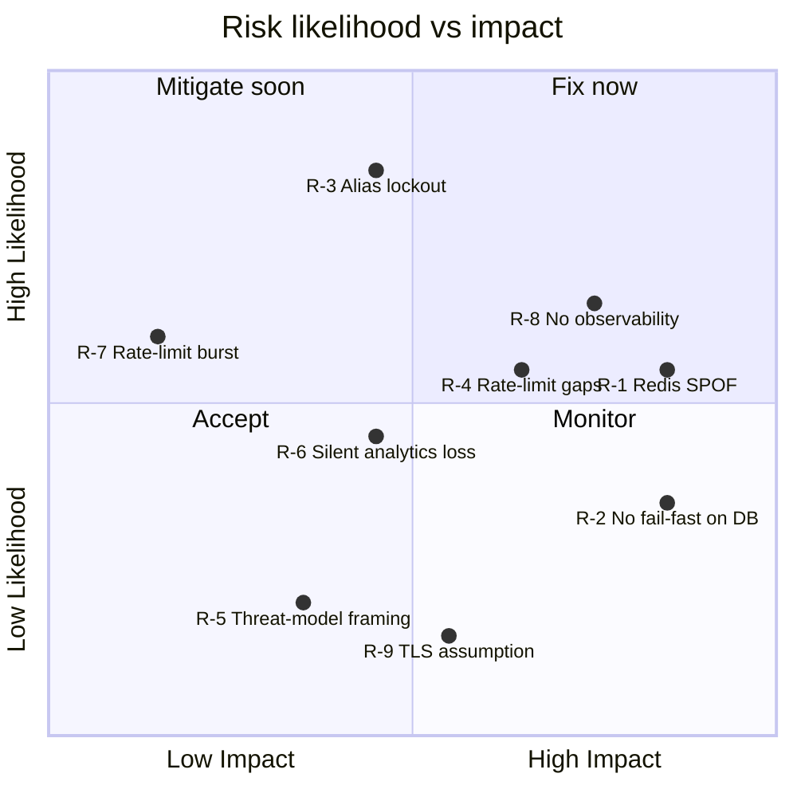

# Risk & Failure-Scenario Analysis

Related: [[../00-Executive-Summary]] · [[01-Architecture-and-Design]] · [[03-Business-Rules-and-Guardrails]] · [[02-Agentic-Workflow-and-Jira-Tickets]] · [[../Scenarios/B-Brownfield-Refactoring]]

## Failure mode analysis by dependency

| Component | Failure mode | Blast radius | Residual risk |
|---|---|---|---|
| PostgreSQL | Unreachable / slow | Total outage | **High** — [[../Risks/R-2-No-Fail-Fast-on-Postgres]] |
| Redis | Unreachable | Cache, rate limiting, idempotency guard all depend on it | Medium (was High) — [[../Risks/R-1-Redis-Triple-Point-of-Failure]] |
| Kafka (producer) | Unreachable | None user-facing — fire-and-forget | Medium — [[../Risks/R-6-Silent-Analytics-Data-Loss]] |
| Kafka (consumer) | Slow / rebalancing | Analytics lag only | Low |

## Risk register

* [[../Risks/R-1-Redis-Triple-Point-of-Failure]] - High. 🟡 Partially fixed — URL-502.
* [[../Risks/R-2-No-Fail-Fast-on-Postgres]] - High. ⬜ Open.
* [[../Risks/R-3-Deleted-Aliases-Permanently-Unusable]] - High. ✅ Fixed — URL-501.
* [[../Risks/R-4-Rate-Limiting-Coverage-Gaps]] - Medium-High. ⬜ Open.
* [[../Risks/R-5-SSRF-Threat-Model-Correction]] - Medium (informational). 🟡 Docs reframed.
* [[../Risks/R-6-Silent-Analytics-Data-Loss]] - Medium. ⬜ Open.
* [[../Risks/R-7-Rate-Limiter-Boundary-Burst]] - Low. ✅ Accepted trade-off.
* [[../Risks/R-8-No-Observability-Instrumentation]] - High (force-multiplier). ⬜ Open.
* [[../Risks/R-9-TLS-Termination-Assumption]] - Low. ✅ Disclosed assumption.

## Risk map

## Prioritized follow-ups

Architect authorized priorities 1 and 3 only — see [[../Scenarios/B-Brownfield-Refactoring]].

1. [[../Risks/R-3-Deleted-Aliases-Permanently-Unusable]] - ✅ Done — URL-501.
2. [[../Risks/R-8-No-Observability-Instrumentation]] - ⬜ Not authorized this round.
3. [[../Risks/R-1-Redis-Triple-Point-of-Failure]] - 🟡 Partial — cache-aside only.
4. [[../Risks/R-4-Rate-Limiting-Coverage-Gaps]] - ⬜ Not authorized this round.
5. [[../Risks/R-2-No-Fail-Fast-on-Postgres]] - ⬜ Not authorized this round.
6. [[../Risks/R-5-SSRF-Threat-Model-Correction]] - 🟡 Docs reframed.
